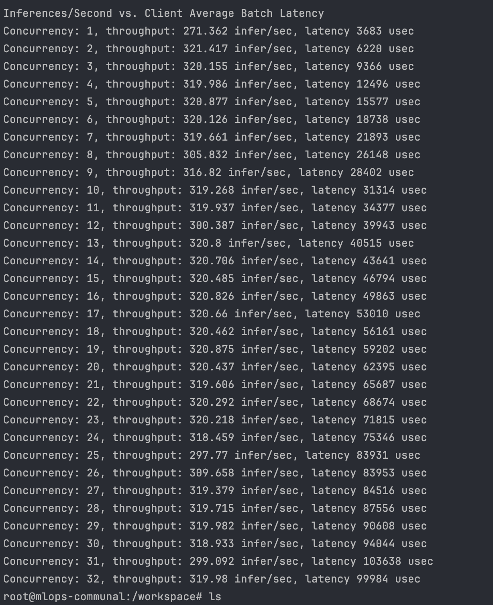
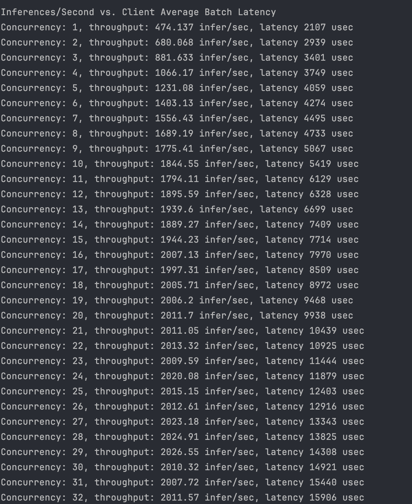
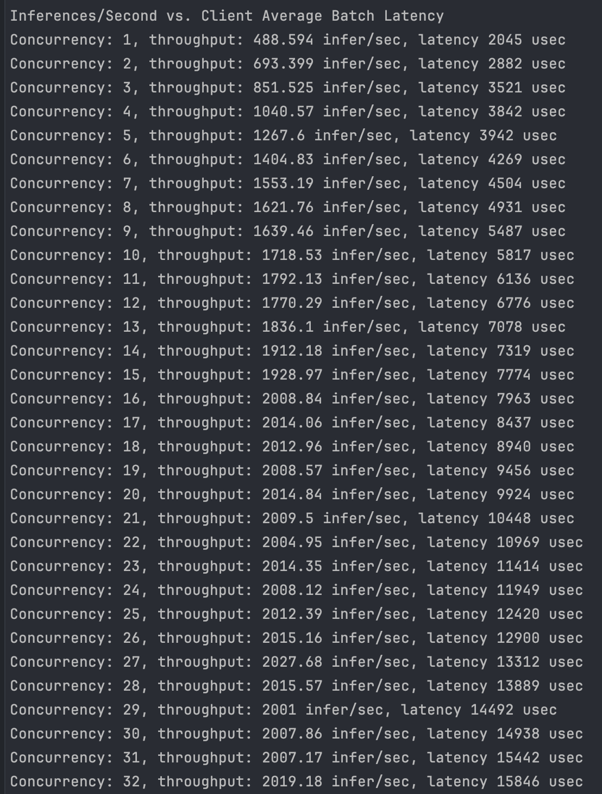
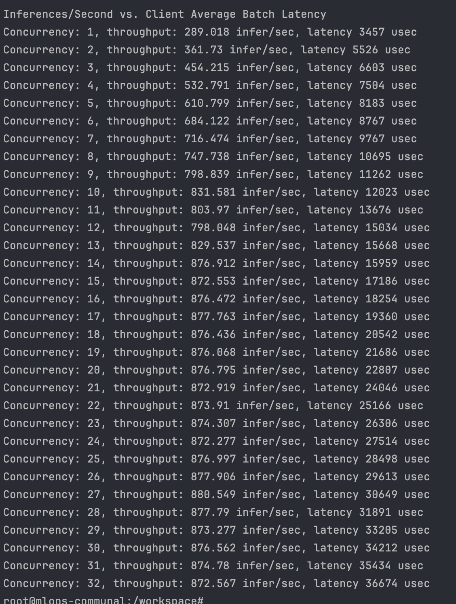
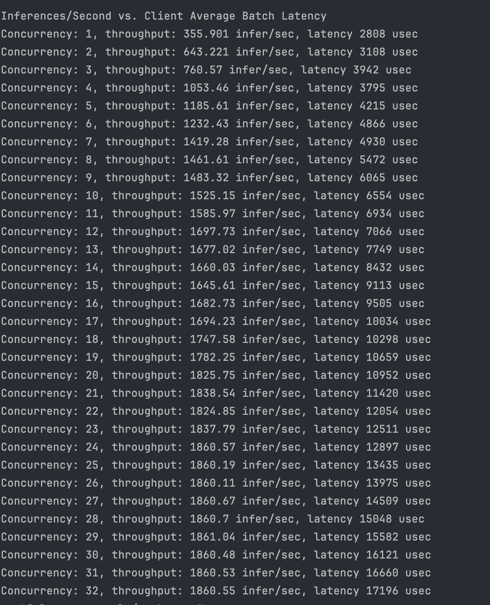
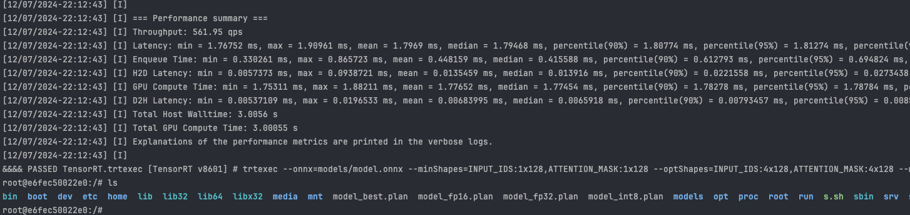
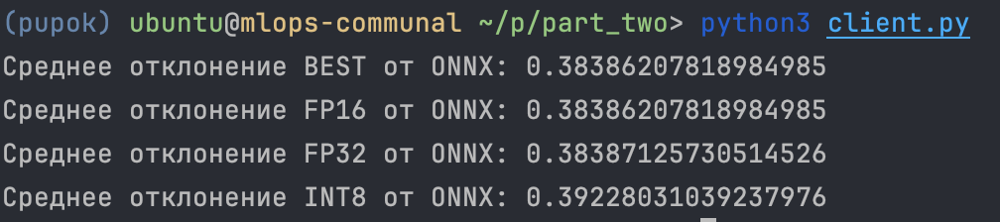

# Супер отчет по 3 домашке

----
## perf_analyzer 
- Отдельно лежат  одноименные ```.csv``` отчеты в папке ```perf_analyzer```

### ONNX


### TRT BEST


### TRT FP16

### TRT FP32

----
### TRT INT8

----

## Отклонения ~~в в моем развитии~~  эмбеддингов trt от ONNX
- Делаем ```.plan``` файлики 

- Делаем сравнение эмбеддингов

----

## Арифметическая сложность модели

- Есть ноутбук где все считал ```part_one/flops.ipynb```

| Layer | FLOPS (1, 20) batch    | Memory (1,20) batch | FLOPS/Memory (1,20) | Limited  |
|-------|------------------------|---------------------|---------------------|----------|
| Proj  | (344064, 6881280)      | (49216, 984320)     | (6.9, 6.9)          | No (Yes) |
| Dense | (1179648, 23592960)    | (2362368, 47247360) | (0.49, 0.49)        | No (Yes) |
| Tanh  | (0, 0)                 | (6144, 122880)      | (0, 0)              | No       |
| Attn  | (66146304, 1322926080) | (9437184, 188743680)         | (7,  7)             | No (Yes) |
| PE    | (0, 0)                 | (1572864, 31457280) | (0, 0)              | No       |


